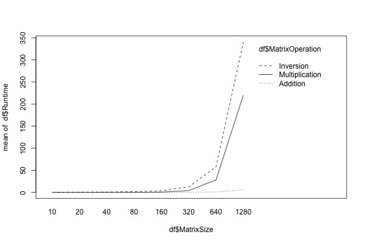

# Preparing Required Packages
```{r load libraries, warning=FALSE, message=FALSE, include=FALSE}
packages.used=as.list(
  c(
  "tidyverse",
  "haven",
  "devtools",
  "RColorBrewer",
  "data.table",
  "ggplot2",
  "car",
  "dplyr",
  "psych",
  "jpeg")
)

check.pkg = function(x){
  if(!require(x, character.only=T)) install.packages(x, 
                                                     character.only=T,
                                                     dependence=T)
}

lapply(packages.used, check.pkg)
library(dplyr)
library(jpeg)
library(car)
library(tidyverse)
library(haven)
library(devtools)
library(RColorBrewer)
library(data.table)
library(ggplot2)
library(psych)
```

# Read Data
```{r}
data <- read.csv("../data/Runtime.csv")
head(data)
```
We tested three types of processors CPU, GPU, and TPU for three kinds of matrix operation, addition, multiplication, and inversion, with the matrix from size 10 to size 2160. We repeat each test for five times.  
**We measured log10(run-time) for each trial, and we use that as the evaluation of the performances.**

# Simple Plots
Here is the general visualization for the performances of each processor under three matrix operations:
```{r}
jpeg(filename = "../figs/overview.jpeg", width = 1000, height = 800,quality = 10000)
ggplot(data = data, aes(x = Processor, y = log10(Runtime))) +
geom_boxplot(aes(fill = MatrixOperation))
while (!is.null(dev.list()))  dev.off()
```
```{r out.width = "90%", fig.align = "center", echo=FALSE}
knitr::include_graphics("../figs/overview.jpeg")
```

# Jingbin Cao Part I
Research different Matrix Sizes
One Way Anova for different matrix sized for each pair of processor and matrix operation:
$\mu_1 = Matrix_{Size}=320$
$\mu_2 = Matrix_{Size}=640$
$\mu_3 = Matrix_{Size}=1280$
$\mu_4 = Matrix_{Size}=2160$

## Getting Data
```{r}
cpu_add <- data[data$Processor == "CPU" & data$MatrixOperation=="Addition" & data$MatrixSize >= 320,]
cpu_mult <- data[data$Processor == "CPU" & data$MatrixOperation=="Multiplication" & data$MatrixSize >= 320,]
cpu_inv <- data[data$Processor == "CPU" & data$MatrixOperation=="Invertion" & data$MatrixSize >= 320,]
gpu_add <- data[data$Processor == "GPU" & data$MatrixOperation=="Addition" & data$MatrixSize >= 320,]
gpu_mult <- data[data$Processor == "GPU" & data$MatrixOperation=="Multiplication" & data$MatrixSize >= 320,]
gpu_inv <- data[data$Processor == "GPU" & data$MatrixOperation=="Invertion" & data$MatrixSize >= 320,]
tpu_add <- data[data$Processor == "TPU" & data$MatrixOperation=="Addition" & data$MatrixSize >= 320,]
tpu_mult <- data[data$Processor == "TPU" & data$MatrixOperation=="Multiplication" & data$MatrixSize >= 320,]
tpu_inv <- data[data$Processor == "TPU" & data$MatrixOperation=="Invertion" & data$MatrixSize >= 320,]
```
## Anovas
```{r}
summary(aov(Runtime ~ as.factor(MatrixSize), data=cpu_add))
summary(aov(Runtime ~ as.factor(MatrixSize), data=cpu_mult))
summary(aov(Runtime ~ as.factor(MatrixSize), data=cpu_inv))
summary(aov(Runtime ~ as.factor(MatrixSize), data=gpu_add))
summary(aov(Runtime ~ as.factor(MatrixSize), data=gpu_mult))
summary(aov(Runtime ~ as.factor(MatrixSize), data=gpu_inv))
summary(aov(Runtime ~ as.factor(MatrixSize), data=tpu_add))
summary(aov(Runtime ~ as.factor(MatrixSize), data=tpu_mult))
summary(aov(Runtime ~ as.factor(MatrixSize), data=tpu_inv))
```


# Zhanhao Zhang Part I  
## Pros & Cons of Each Processor  

When matrix size is the same, is there any processor or operation effects? Or is there any interactive effect?  
```{r summary}
df_cpu <- data[data$Processor == "CPU",]
lm(Runtime ~ MatrixSize + as.factor(MatrixOperation), data = df_cpu) %>%
  summary()
df_gpu <- data[data$Processor == "GPU",]
lm(Runtime ~ MatrixSize + as.factor(MatrixOperation), data = df_gpu) %>%
  summary()
df_tpu <- data[data$Processor == "TPU",]
lm(Runtime ~ MatrixSize + as.factor(MatrixOperation), data = df_tpu) %>%
  summary()

# Reduced Model for TPU
df_tpu <- data[data$Processor == "TPU",]
lm(Runtime ~ as.factor(MatrixOperation), data = df_tpu) %>%
  summary()

# Reduced Model for GPU
df_gpu <- data[data$Processor == "GPU" & data$MatrixOperation != "Multiplication",]
lm(Runtime ~ MatrixSize + as.factor(MatrixOperation), data = df_gpu) %>%
  summary()
```

# Lixian Chen Part I
When the processor is the same, is there any operation and matrix size effect? We want to answer the following question: in each scenario, which processor should we use?

## Getting Data Ready
```{r, prepare data, message=FALSE, warning=FALSE}
# Read Data
df <- fread("../data/Runtime.csv", header=TRUE)
attach(df)

MatrixOperation<-factor(MatrixOperation)
Processor<-factor(Processor)


CPUdata <- df %>% filter(Processor=="CPU")
GPUdata <- df %>% filter(Processor=="GPU")
TPUdata <- df %>% filter(Processor=="TPU")


describeBy(df$Runtime,group = df$MatrixSize, mat = TRUE) %>%  #create dataframe
  select(MatrixSize=group1, N=n, Mean=mean, SD=sd, Median=median, Min=min, Max=max, 
         Skew=skew, Kurtosis=kurtosis, SEM=se)

#boxplot(Runtime~Processor*MatrixOperation)
#tapply(Runtime,list(Processor, MatrixOperation),mean)
#tapply(Runtime,MatrixOperation,mean)

group_by(df, Processor) %>%
  summarise(
    count = n(),
    mean = mean(Runtime, na.rm = TRUE),
    sd = sd(Runtime, na.rm = TRUE)
  )

group_by(df, MatrixOperation) %>%
  summarise(
    count = n(),
    mean = mean(Runtime, na.rm = TRUE),
    sd = sd(Runtime, na.rm = TRUE)
  )

#detach(data) 

size320data <- df %>% filter(MatrixSize==320)
size640data <- df %>% filter(MatrixSize==640)
size1280data <- df %>% filter(MatrixSize==1280)
size2560data <- df %>% filter(MatrixSize==2560)
```

## Analysis
### Anova
```{r}
############ 320
fit2<-lm(log10(Runtime)~Processor+MatrixOperation, data = size320data)
summary(fit2)
fit1<-lm(log10(Runtime)~Processor*MatrixOperation, data = size320data)
summary(fit1)
anova(fit2, fit1)

mod320<-aov(log10(Runtime)~Processor*MatrixOperation, data = size320data)
#summary(mod320)
Anova(mod320,type="III")

modF<-lm(log10(Runtime)~Processor+MatrixOperation, data = size320data)
modA<-lm(log10(Runtime)~Processor, data = size320data)
modB<-lm(log10(Runtime)~MatrixOperation, data = size320data)

anova(modA, modF)
anova(modB, modF)
```
```{r}
################# 640
fit2_640<-lm(Runtime~Processor+MatrixOperation, data = size640data)
summary(fit2)
fit1_640<-lm(Runtime~Processor*MatrixOperation, data = size640data)
summary(fit1_640)
anova(fit2_640, fit1_640)

mod640<-aov(Runtime~Processor*MatrixOperation, data = size640data)
Anova(mod640,type="III")


modF<-lm(Runtime~Processor+MatrixOperation, data = size640data)
modA<-lm(Runtime~Processor, data = size640data)
modB<-lm(Runtime~MatrixOperation, data = size640data)

anova(modA, modF)
anova(modB, modF)

##################### 1280
fit2_1280<-lm(Runtime~Processor+MatrixOperation, data = size1280data)
summary(fit2)
fit1_1280<-lm(Runtime~Processor*MatrixOperation, data = size1280data)
summary(fit1_1280)
anova(fit2_1280, fit1_1280)

modF<-lm(Runtime~Processor+MatrixOperation, data = size1280data)
modA<-lm(Runtime~Processor, data = size1280data)
modB<-lm(Runtime~MatrixOperation, data = size1280data)

anova(modA, modF)
anova(modB, modF)

mod1280<-aov(Runtime~Processor*MatrixOperation, data = size1280data)
Anova(mod1280,type="III")

################## 2560
fit2_2560<-lm(Runtime~Processor+MatrixOperation, data = size2560data)
summary(fit2)
fit1_2560<-lm(Runtime~Processor*MatrixOperation, data = size2560data)
summary(fit1_2560)
anova(fit2_2560, fit1_2560)

mod2560<-aov(Runtime~Processor*MatrixOperation, data = size2560data)
Anova(mod2560,type="III")

modF<-lm(Runtime~Processor+MatrixOperation, data = size2560data)
modA<-lm(Runtime~Processor, data = size2560data)
modB<-lm(Runtime~MatrixOperation, data = size2560data)

anova(modA, modF)
anova(modB, modF)
```

### Mean of Runtime
```{r}
tapply(Runtime,list(Processor, MatrixOperation),mean, data = size320data)
tapply(Runtime,list(Processor, MatrixOperation),mean, data = size640data)
tapply(Runtime,list(Processor, MatrixOperation),mean, data = size1280data)
tapply(Runtime,list(Processor, MatrixOperation),mean, data = size2560data)
```

# Zhanhao Zhang Part II
## General Visualization
```{r,echo=FALSE}
plot_list = list()
for(operation in unique(data$MatrixOperation)){
  p <- data %>%
    filter(MatrixOperation == operation) %>%
    ggplot(aes(x = Processor, y = log10(Runtime))) +
    geom_boxplot(aes(fill = as.factor(MatrixSize))) +
    ggtitle(paste0("Matrix Operation: ", operation)) +
    #facet_wrap( ~ MatrixOperation, scales = "free", nrow = 1) +
    guides(fill=guide_legend(title = "Matrix Size"))
  #print(p)
  plot_list[[operation]] = p
}

# Save plots to jpeg
pdf("../figs/operations_plots.pdf")
for(operation in unique(data$MatrixOperation)){
  print(plot_list[[operation]])
}  
while (!is.null(dev.list()))  dev.off()
```
\begin{figure}
\includegraphics[page=1,width=0.5\linewidth]{../figs/operations_plots.pdf}
\includegraphics[page=2,width=0.5\linewidth]{../figs/operations_plots.pdf}
\includegraphics[page=3,width=0.5\linewidth]{../figs/operations_plots.pdf}
\caption{\label{fig:operation} Operation v.s. Processors for Each Matrix Size}
\end{figure}

```{r,echo=FALSE}
plot_list = list()
for(size in unique(data$MatrixSize)){
  p <- data %>%
    filter(MatrixSize == size) %>%
    ggplot(aes(x = MatrixOperation, y = log10(Runtime))) +
    geom_boxplot(aes(fill = as.factor(Processor))) +
    ggtitle(paste0("Matrix Size: ", size)) +
    #facet_wrap( ~ MatrixOperation, scales = "free", nrow = 1) +
    guides(fill=guide_legend(title = "Processor"))
 #print(p)
  plot_list[[size]] = p
}

# Save plots to jpeg
pdf("../figs/size_plots.pdf")
for(size in unique(data$MatrixSize)){
  print(plot_list[[size]])
}  
while (!is.null(dev.list()))  dev.off()
```
\begin{figure}
\includegraphics[page=1,width=0.333\linewidth]{../figs/size_plots.pdf}
\includegraphics[page=2,width=0.333\linewidth]{../figs/size_plots.pdf}
\includegraphics[page=3,width=0.333\linewidth]{../figs/size_plots.pdf}
\includegraphics[page=4,width=0.333\linewidth]{../figs/size_plots.pdf}
\includegraphics[page=5,width=0.333\linewidth]{../figs/size_plots.pdf}
\includegraphics[page=6,width=0.333\linewidth]{../figs/size_plots.pdf}
\includegraphics[page=7,width=0.333\linewidth]{../figs/size_plots.pdf}
\includegraphics[page=8,width=0.333\linewidth]{../figs/size_plots.pdf}
\includegraphics[page=9,width=0.333\linewidth]{../figs/size_plots.pdf}
\caption{\label{fig:Size} Matrix Size v.s. Operations for Each Processor.}
\end{figure}

```{r, echo = FALSE}
plot_list = list()
for(operation in unique(data$MatrixOperation)){
  p <- data %>%
    filter(MatrixOperation == operation) %>%
    ggplot(aes(x = as.factor(MatrixSize), y = log10(Runtime))) +
    geom_boxplot(aes(fill = as.factor(Processor))) +
    ggtitle(paste0("Matrix Operation: ", operation)) +
    #facet_wrap( ~ MatrixOperation, scales = "free", nrow = 1) +
    guides(fill=guide_legend(title = "Processor"))
  #print(p)
  plot_list[[operation]] = p
}

pdf("../figs/operation_size.pdf")
for(operation in unique(data$MatrixOperation)){
  print(plot_list[[operation]])
}  
while (!is.null(dev.list()))  dev.off()
```
\begin{figure}
\includegraphics[page=1,width=0.5\linewidth]{../figs/operation_size.pdf}
\includegraphics[page=2,width=0.5\linewidth]{../figs/operation_size.pdf}
\includegraphics[page=3,width=0.5\linewidth]{../figs/operation_size.pdf}
\caption{\label{fig:operation} Operation v.s. Matrix Size for Each Processor}
\end{figure}

# Lixian Chen Part II: Plots
## Interaction Plots  
```{r, interaction plots}
jpeg(filename = "../figs/interaction_size_time.jpeg", width = 600, height = 400,quality = 10000)
interaction.plot(df$MatrixSize, df$MatrixOperation, df$Runtime)
while (!is.null(dev.list()))  dev.off()
```
```{r out.width = "90%", fig.align = "center", echo=FALSE}

```

```{r}
jpeg(filename = "../figs/interaction_size_log_time.jpeg", width = 600, height = 400,quality = 10000)
interaction.plot(df$MatrixSize, df$MatrixOperation, log(df$Runtime))
while (!is.null(dev.list()))  dev.off()
```
```{r out.width = "90%", fig.align = "center", echo=FALSE}
knitr::include_graphics("../figs/interaction_size_log_time.jpeg")
```

```{r}
jpeg(filename = "../figs/interaction_CPU_size_time.jpeg", width = 600, height = 400,quality = 10000)
interaction.plot(CPUdata$MatrixSize, CPUdata$MatrixOperation, CPUdata$Runtime)
while (!is.null(dev.list()))  dev.off()
```
```{r out.width = "90%", fig.align = "center", echo=FALSE}
knitr::include_graphics("../figs/interaction_CPU_size_time.jpeg")
```

```{r}
jpeg(filename = "../figs/interaction_GPU_size_time.jpeg", width = 600, height = 400,quality = 10000)
interaction.plot(GPUdata$MatrixSize, GPUdata$MatrixOperation, GPUdata$Runtime)
while (!is.null(dev.list()))  dev.off()
```
```{r out.width = "90%", fig.align = "center", echo=FALSE}

```

```{r}
jpeg(filename = "../figs/interaction_TPU_size_time.jpeg", width = 600, height = 400,quality = 10000)
interaction.plot(TPUdata$MatrixSize, TPUdata$MatrixOperation, TPUdata$Runtime)
while (!is.null(dev.list()))  dev.off()
```
```{r out.width = "90%", fig.align = "center", echo=FALSE}
knitr::include_graphics("../figs/interaction_TPU_size_time.jpeg")
```

## Boxplots

```{r}
jpeg(filename = "../figs/Operation_vs_runtime_size320.jpeg", width = 1400, height = 400,quality = 10000)
boxplot(Runtime~Processor*MatrixOperation, data = size320data, main="At the level of matrix size=320")
while (!is.null(dev.list()))  dev.off()
```
```{r out.width = "90%", fig.align = "center", echo=FALSE}
knitr::include_graphics("../figs/Operation_vs_runtime_size320.jpeg")
```

```{r}
jpeg(filename = "../figs/Operation_vs_runtime_size640.jpeg", width = 1400, height = 400,quality = 10000)
boxplot(Runtime~Processor*MatrixOperation, data = size640data, main="At the level of matrix size=640")
while (!is.null(dev.list()))  dev.off()
```
```{r out.width = "90%", fig.align = "center", echo=FALSE}
knitr::include_graphics("../figs/Operation_vs_runtime_size640.jpeg")
```

```{r}
jpeg(filename = "../figs/Operation_vs_runtime_size1280.jpeg", width = 1400, height = 400,quality = 10000)
boxplot(Runtime~Processor*MatrixOperation, data = size1280data, main="At the level of matrix size=1280")
while (!is.null(dev.list()))  dev.off()
```
```{r out.width = "90%", fig.align = "center", echo=FALSE}
knitr::include_graphics("../figs/Operation_vs_runtime_size1280.jpeg")
```

```{r}
jpeg(filename = "../figs/Operation_vs_runtime_size2560.jpeg", width = 1400, height = 400,quality = 10000)
boxplot(Runtime~Processor*MatrixOperation, data = size2560data, main="At the level of matrix size=2560")
while (!is.null(dev.list()))  dev.off()
```
```{r out.width = "90%", fig.align = "center", echo=FALSE}

```
At the level of matrix size=2560, avoid using CPU for inversion and multiplication because its run-times are much bigger.

```{r, message=FALSE, warning=FALSE, echo=FALSE}
# Addition & CPU
data[data$Processor == "CPU" & data$MatrixOperation=="Addition",] %>%
ggplot() +
geom_point(mapping = aes(x = MatrixSize, y = log(Runtime))) +
geom_smooth(mapping = aes(x = MatrixSize, y = log(Runtime))) +
labs(title = "For CPU and Addition with Different Matrix Size", x = "Matrix Size", y = "Runtime")
# Multiplication & CPU
data[data$Processor == "CPU" & data$MatrixOperation=="Multiplication",] %>%
ggplot() +
geom_point(mapping = aes(x = MatrixSize, y = log(Runtime))) +
geom_smooth(mapping = aes(x = MatrixSize, y = log(Runtime))) +
labs(title = "For CPU and Multiplication with Different Matrix Size", x = "Matrix Size", y = "Runtime")
# Invertion & CPU
data[data$Processor == "CPU" & data$MatrixOperation=="Invertion",] %>%
ggplot() +
geom_point(mapping = aes(x = MatrixSize, y = log(Runtime))) +
geom_smooth(mapping = aes(x = MatrixSize, y = log(Runtime))) +
labs(title = "For CPU and Invertion with Different Matrix Size", x = "Matrix Size", y = "Runtime")

# Addition & GPU
data[data$Processor == "GPU" & data$MatrixOperation=="Addition",] %>%
ggplot() +
geom_point(mapping = aes(x = MatrixSize, y = log(Runtime))) +
geom_smooth(mapping = aes(x = MatrixSize, y = log(Runtime))) +
labs(title = "For GPU and Addition with Different Matrix Size", x = "Matrix Size", y = "Runtime")
# Multiplication & GPU
data[data$Processor == "GPU" & data$MatrixOperation=="Multiplication",] %>%
ggplot() +
geom_point(mapping = aes(x = MatrixSize, y = log(Runtime))) +
geom_smooth(mapping = aes(x = MatrixSize, y = log(Runtime))) +
labs(title = "For GPU and Multiplication with Different Matrix Size", x = "Matrix Size", y = "Runtime")
# Invertion & GPU
data[data$Processor == "GPU" & data$MatrixOperation=="Invertion",] %>%
ggplot() +
geom_point(mapping = aes(x = MatrixSize, y = log(Runtime))) +
geom_smooth(mapping = aes(x = MatrixSize, y = log(Runtime))) +
labs(title = "For GPU and Invertion with Different Matrix Size", x = "Matrix Size", y = "Runtime")

# Addition & TPU
data[data$Processor == "TPU" & data$MatrixOperation=="Addition",] %>%
ggplot() +
geom_point(mapping = aes(x = MatrixSize, y = Runtime)) +
geom_smooth(mapping = aes(x = MatrixSize, y = Runtime)) +
labs(title = "For TPU and Addition with Different Matrix Size", x = "Matrix Size", y = "Runtime")
# Multiplication & TPU
data[data$Processor == "TPU" & data$MatrixOperation=="Multiplication",] %>%
ggplot() +
geom_point(mapping = aes(x = MatrixSize, y = Runtime)) +
geom_smooth(mapping = aes(x = MatrixSize, y = Runtime)) +
labs(title = "For TPU and Multiplication with Different Matrix Size", x = "Matrix Size", y = "Runtime")
# Invertion & TPU
data[data$Processor == "TPU" & data$MatrixOperation=="Invertion",] %>%
ggplot() +
geom_point(mapping = aes(x = MatrixSize, y = Runtime)) +
geom_smooth(mapping = aes(x = MatrixSize, y = Runtime)) +
labs(title = "For TPU and Invertion with Different Matrix Size", x = "Matrix Size", y = "Runtime")
```

