# Preparing Required Packages
```{r load libraries, warning=FALSE, message=FALSE, include=FALSE}
packages.used=as.list(
  c(
  "tidyverse",
  "haven",
  "devtools",
  "RColorBrewer",
  "data.table",
  "ggplot2",
  "car",
  "dplyr",
  "psych",
  "jpeg")
)

check.pkg = function(x){
  if(!require(x, character.only=T)) install.packages(x, 
                                                     character.only=T,
                                                     dependence=T)
}

lapply(packages.used, check.pkg)
library(dplyr)
library(jpeg)
library(car)
library(tidyverse)
library(haven)
library(devtools)
library(RColorBrewer)
library(data.table)
library(ggplot2)
library(psych)
```

# Read Data
```{r}
data <- read.csv("../data/Runtime.csv")
head(data)
```
We tested three types of processors CPU, GPU, and TPU for three kinds of matrix operation, addition, multiplication, and inversion, with the matrix from size 10 to size 2160. We repeat each test for five times.  
**We measured log10(run-time) for each trial, and we use that as the evaluation of the performances.**

# Simple Plots
Here is the general visualization for the performances of each processor under three matrix operations:
```{r}
jpeg(filename = "../figs/overview.jpeg", width = 1000, height = 800,quality = 10000)
ggplot(data = data, aes(x = Processor, y = log10(Runtime))) +
geom_boxplot(aes(fill = MatrixOperation))
while (!is.null(dev.list()))  dev.off()
```
```{r out.width = "90%", fig.align = "center", echo=FALSE}

```

# Jingbin Cao Part I
Research different Matrix Sizes
One Way Anova for different matrix sized for each pair of processor and matrix operation:
$\mu_1 = Matrix_{Size}=160$
$\mu_2 = Matrix_{Size}=320$
$\mu_3 = Matrix_{Size}=640$
$\mu_4 = Matrix_{Size}=1280$

## Getting Data
```{r}
cpu_add <- data[data$Processor == "CPU" & data$MatrixOperation=="Addition" & data$MatrixSize >= 160,]
cpu_mult <- data[data$Processor == "CPU" & data$MatrixOperation=="Multiplication" & data$MatrixSize >= 160,]
cpu_inv <- data[data$Processor == "CPU" & data$MatrixOperation=="Inversion" & data$MatrixSize >= 160,]
gpu_add <- data[data$Processor == "GPU" & data$MatrixOperation=="Addition" & data$MatrixSize >= 160,]
gpu_mult <- data[data$Processor == "GPU" & data$MatrixOperation=="Multiplication" & data$MatrixSize >= 160,]
gpu_inv <- data[data$Processor == "GPU" & data$MatrixOperation=="Inversion" & data$MatrixSize >= 160,]
tpu_add <- data[data$Processor == "TPU" & data$MatrixOperation=="Addition" & data$MatrixSize >= 160,]
tpu_mult <- data[data$Processor == "TPU" & data$MatrixOperation=="Multiplication" & data$MatrixSize >= 160,]
tpu_inv <- data[data$Processor == "TPU" & data$MatrixOperation=="Inversion" & data$MatrixSize >= 160,]
```
## Anovas
```{r}
summary(mod_cpu_add <- aov(log10(Runtime) ~ as.factor(MatrixSize), data=cpu_add))
summary(mod_cpu_mult <- aov(log10(Runtime) ~ as.factor(MatrixSize), data=cpu_mult))
summary(mod_cpu_inv <- aov(log10(Runtime) ~ as.factor(MatrixSize), data=cpu_inv))
summary(mod_gpu_add <- aov(log10(Runtime) ~ as.factor(MatrixSize), data=gpu_add))
summary(mod_gpu_mult <- aov(log10(Runtime) ~ as.factor(MatrixSize), data=gpu_mult))
summary(mod_gpu_inv <- aov(log10(Runtime) ~ as.factor(MatrixSize), data=gpu_inv))
summary(mod_tpu_add <- aov(log10(Runtime) ~ as.factor(MatrixSize), data=tpu_add))
summary(mod_tpu_mult <- aov(log10(Runtime) ~ as.factor(MatrixSize), data=tpu_mult))
summary(mod_tpu_inv <- aov(log10(Runtime) ~ as.factor(MatrixSize), data=tpu_inv))

# From the tables, we can see that only TPU & Multiplication and TPU & Inversion do not have Matrix Size effect, but other nine pairs do have Matrix Size effects.
# plot(aov(Runtime ~ as.factor(MatrixSize), data=tpu_mult))
# plot(aov(Runtime ~ as.factor(MatrixSize), data=tpu_inv))
```

### Confidence Interval for LMs
```{r}
round(digits=4,confint(mod_cpu_add))
round(digits=4,confint(mod_cpu_mult))
round(digits=4,confint(mod_cpu_inv))
round(confint(mod_gpu_add),4)
round(digits=4,confint(mod_gpu_mult))
round(digits=4,confint(mod_gpu_inv))
```

# Zhanhao Zhang Part I  
## Interaction Plots
```{r}
#ggplot(data = data, aes(x = Processor, y = log10(Runtime))) +
 # geom_boxplot(aes(fill = MatrixOperation))
for(operation in unique(data$MatrixOperation)){
  #png(paste0("../figs/", operation, ".png"), width = 500, height = 500)
  p <- data %>%
    dplyr::filter(MatrixOperation == operation) %>%
    group_by(MatrixSize, MatrixOperation, Processor) %>%
    summarize(Runtime = mean(Runtime)) %>%
    ggplot(aes(x = Processor, y = Runtime)) +
    #geom_boxplot(aes(fill = as.factor(MatrixSize))) +
    geom_bar(aes(fill = as.factor(MatrixSize)), stat = "identity",
             position = "dodge") +
    scale_y_log10() +
    ggtitle(paste0("Matrix Operation: ", operation)) +
    #facet_wrap( ~ MatrixOperation, scales = "free", nrow = 1) +
    guides(fill=guide_legend(title = "Matrix Size"))
  print(p)
  #dev.off()
}
```

```{r}
for(size in unique(data$MatrixSize)){
  p <- data %>%
    dplyr::filter(MatrixSize == size) %>%
    group_by(MatrixSize, MatrixOperation, Processor) %>%
    summarize(Runtime = mean(Runtime)) %>%
    ggplot(aes(x = Processor, y = Runtime)) +
    #geom_boxplot(aes(fill = as.factor(MatrixOperation))) +
    geom_bar(aes(fill = as.factor(MatrixOperation)), position = "dodge",
             stat = "identity") +
    scale_y_log10() +
    ggtitle(paste0("Matrix Size: ", size)) +
    #facet_wrap( ~ MatrixOperation, scales = "free", nrow = 1) +
    guides(fill=guide_legend(title = "Matrix Operation"))
  print(p)
}
```

```{r}
for(size in unique(data$MatrixSize)){
  p <- data %>%
    dplyr::filter(MatrixSize == size) %>%
    group_by(MatrixSize, MatrixOperation, Processor) %>%
    summarize(Runtime = mean(Runtime)) %>%
    ggplot(aes(x = MatrixOperation, y = Runtime)) +
    #geom_boxplot(aes(fill = as.factor(Processor))) +
    geom_bar(aes(fill = as.factor(Processor)), position = "dodge", 
             stat = "identity") +
    scale_y_log10() +
    ggtitle(paste0("Matrix Size: ", size)) +
    #facet_wrap( ~ MatrixOperation, scales = "free", nrow = 1) +
    guides(fill=guide_legend(title = "Processor"))
  print(p)
}
```

```{r}
for(operation in unique(data$MatrixOperation)){
  p <- data %>%
    dplyr::filter(MatrixOperation == operation) %>%
    group_by(MatrixSize, MatrixOperation, Processor) %>%
    summarize(Runtime = mean(Runtime)) %>%
    ggplot(aes(x = as.factor(MatrixSize), y = Runtime)) +
    #geom_boxplot(aes(fill = as.factor(Processor))) +
    geom_bar(aes(fill = as.factor(Processor)), stat = "identity", 
             alpha = 1, position = "dodge") +
    scale_y_log10() +
    ggtitle(paste0("Matrix Operation: ", operation)) +
    #facet_wrap( ~ MatrixOperation, scales = "free", nrow = 1) +
    guides(fill=guide_legend(title = "Processor"))
  print(p)
}
```

## Pros & Cons of Each Processor
CPU:
```{r}
df_cpu <- data[data$Processor == "CPU",]
linreg_cpu <- lm(Runtime ~ MatrixSize + as.factor(MatrixOperation), 
                 data = df_cpu)
summary(linreg_cpu) %>% print()
plot(linreg_cpu$residuals)
abline(h=0, col="red")
boxCox(linreg_cpu)

linreg_cpu_trans <- lm(log(Runtime) ~ MatrixSize + as.factor(MatrixOperation), 
                 data = df_cpu)
plot(linreg_cpu_trans$fitted.values, linreg_cpu_trans$residuals)
abline(h=0, col="red")
```
GPU:
```{r}
df_gpu <- data[(data$Processor == "GPU") & (data$MatrixOperation != "Multiplication"),]
linreg_gpu <- lm(Runtime ~ MatrixSize + as.factor(MatrixOperation), 
                 data = df_gpu)
summary(linreg_gpu) %>% print()
plot(linreg_gpu$residuals)
abline(h=0, col="red")
boxCox(linreg_gpu)

linreg_gpu_trans <- lm(log10(Runtime) ~ MatrixSize +
                         as.factor(MatrixOperation), data = df_gpu)
summary(linreg_gpu_trans)
plot(linreg_gpu_trans$residuals)
abline(h=0, col="red")
```

TPU:
```{r}
df_tpu <- data[data$Processor == "TPU",]
linreg_tpu <- lm(Runtime ~ MatrixSize + as.factor(MatrixOperation), 
                 data = df_tpu)
summary(linreg_tpu) %>% print()
plot(linreg_tpu$residuals)
abline(h=0, col="red")
boxCox(linreg_tpu)

linreg_tpu_trans <- lm(log10(Runtime) ~ MatrixSize +
                         as.factor(MatrixOperation), data = df_tpu)
summary(linreg_tpu_trans) %>% print()
m <- max(abs(linreg_tpu_trans$residuals))
plot(linreg_tpu_trans$residuals, ylim=c(-m, m))
abline(h=0, col="red")
```

GPU Addition
```{r}
df_small <- data[(data$Processor == "GPU") & (data$MatrixOperation == "Addition"),]
linreg_small <- lm(Runtime ~ MatrixSize, data = df_small)
plot(linreg_small$residuals)
abline(h=0, col="red")
boxCox(linreg_small, lambda = seq(-20, 2, 0.1))

linreg_small_transform <- lm(log10(Runtime) ~ MatrixSize, data = df_small)
plot(linreg_small_transform$residuals)
abline(h=0, col="red")

plot(df_small$MatrixSize, log10(df_small$Runtime))
abline(a=linreg_small_transform$coefficients[1], 
       b=linreg_small_transform$coefficients[2])
```

GPU Multiplication
```{r}
df_small <- data[(data$Processor == "GPU") & (data$MatrixOperation == "Multiplication"),]
linreg_small <- lm(Runtime ~ MatrixSize, data = df_small)
plot(linreg_small$residuals)
abline(h=0, col="red")
boxCox(linreg_small, lambda = seq(-10, 2, 0.1))

linreg_small_transform <- lm(log10(Runtime) ~ MatrixSize, data = df_small)
summary(linreg_small_transform)
plot(linreg_small_transform$residuals)
abline(h=0, col="red")

plot(df_small$MatrixSize, log10(df_small$Runtime))
abline(a=linreg_small_transform$coefficients[1], 
       b=linreg_small_transform$coefficients[2])
```

GPU Inversion
```{r}
df_small <- data[(data$Processor == "GPU") & (data$MatrixOperation == "Inversion"),]
linreg_small <- lm(Runtime ~ MatrixSize, data = df_small)
plot(linreg_small$fitted.values, linreg_small$residuals)
abline(h=0, col="red")
boxCox(linreg_small, lambda = seq(-2, 2, 0.1))

linreg_small_transform <- lm((Runtime^(2/3)) ~ MatrixSize, data = df_small)
summary(linreg_small_transform)
#plot(linreg_small_transform)
plot(linreg_small_transform$fitted.values, linreg_small_transform$residuals)
abline(h=0, col="red")

plot(df_small$MatrixSize, df_small$Runtime^(2/3))
abline(a=linreg_small_transform$coefficients[1], 
       b=linreg_small_transform$coefficients[2])
```

TPU Addition
```{r}
df_small <- data[(data$Processor == "TPU") & (data$MatrixOperation == "Addition"),]
linreg_small <- lm(Runtime ~ MatrixSize, data = df_small)
plot(linreg_small$residuals)
abline(h=0, col="red")
boxCox(linreg_small, lambda = seq(-20, 2, 0.1))

linreg_small_transform <- lm(log10(Runtime) ~ MatrixSize, data = df_small)
summary(linreg_small_transform)
m <- max(abs(linreg_small_transform$residuals))
plot(linreg_small_transform$residuals, ylim=c(-m, m))
abline(h=0, col="red")
```

TPU Multiplication
```{r}
df_small <- data[(data$Processor == "TPU") & (data$MatrixOperation == "Multiplication"),]
linreg_small <- lm(Runtime ~ MatrixSize, data = df_small)
plot(linreg_small$residuals)
abline(h=0, col="red")
boxCox(linreg_small, lambda = seq(-20, 2, 0.1))

linreg_small_transform <- lm(log10(Runtime) ~ MatrixSize, data = df_small)
summary(linreg_small_transform)
m <- max(abs(linreg_small_transform$residuals))
plot(linreg_small_transform$residuals, ylim=c(-m, m))
abline(h=0, col="red")
```

TPU Inversion
```{r}
df_small <- data[(data$Processor == "TPU") & (data$MatrixOperation == "Inversion"),]
linreg_small <- lm(Runtime ~ MatrixSize, data = df_small)
plot(linreg_small$residuals)
abline(h=0, col="red")
boxCox(linreg_small, lambda = seq(-20, 2, 0.1))

linreg_small_transform <- lm(log10(Runtime) ~ MatrixSize, data = df_small)
summary(linreg_small_transform)
#plot(linreg_small_transform)
m <- max(abs(linreg_small_transform$residuals))
plot(linreg_small_transform$residuals, ylim=c(-m, m))
abline(h=0, col="red")
```

ANOVA tests fixing matrix operation and matrix size
```{r}
operation_arr <- unique(data$MatrixOperation)
size_arr <- unique(data$MatrixSize)

p_val_table <- matrix(0, nrow = length(size_arr), ncol = 2 * length(operation_arr))
rownames(p_val_table) <- size_arr
colnames(p_val_table) <- c(paste0("GPU_", operation_arr), 
                           paste0("TPU_", operation_arr))
est_table <- matrix(0, nrow = length(size_arr), ncol = 2 * length(operation_arr))
ci_table <- matrix(0, nrow = length(size_arr), ncol = 2 * length(operation_arr))

for(i in 1:length(operation_arr)){
  for(j in 1:length(size_arr)){
    operation <- operation_arr[i]
    size <- size_arr[j]
    
    headline <- paste0("Operation = ", operation, "; Size = ", size)
    df_small <- data[(data$MatrixOperation == operation) & (data$MatrixSize == size),]
    linreg_small <- lm(Runtime ~ Processor, data = df_small)
    sm <- summary(linreg_small)
    print(paste0(headline, ": ", round(sm$adj.r.squared, 3)))
    p_val_table[j, i] <- as.numeric(sm$coefficients[2,4])
    p_val_table[j, length(operation_arr)+i] <- as.numeric(sm$coefficients[3,4])
    
    est_table[j, i] <- paste0(round(sm$coefficients[2,1], 3), " (", 
                              round(sm$coefficients[2,2], 3), ")")
    est_table[j, length(operation_arr)+i] <- paste0(round(sm$coefficients[3,1], 3),
                                                    " (", 
                                                    round(sm$coefficients[3,2], 3),
                                                    ")")
    ci_gpu <- round(sm$coefficients[2,1] + 
                      c(-1,1)*qnorm(0.975)*sm$coefficients[2,2], 3)
    ci_tpu <- round(sm$coefficients[3,1] + 
                      c(-1,1)*qnorm(0.975)*sm$coefficients[3,2], 3)
    ci_table[j, i] <- paste0("(", ci_gpu[1], " to ", ci_gpu[2], ")")
    ci_table[j, length(operation_arr)+i] <- paste0("(", ci_tpu[1], " to ",
                                                   ci_tpu[2], ")")
    #print(headline)
    #print(summary(linreg_small))
    m <- max(abs(linreg_small$residuals))
    plot(linreg_small$fitted.values, linreg_small$residuals, main = headline,
         xlab = "Fitted Values", ylab = "Residuals", ylim=c(-m, m))
    abline(h=0, col="red")
  }
}
#print(p_val_table)

parse_number <- function(x){
  ret <- paste0("$", str_replace_all(formatC(x, digits=4), "e", " \times 10^{"))
  if(str_detect(ret, "\times")){
    ret <- paste0(ret, "}")
  }
  ret <- paste0(ret, "$")
  ret
}
p_val_display <- p_val_table
for(i in 1:nrow(p_val_display)){
  for(j in 1:ncol(p_val_display)){
    p_val_display[i, j] <- parse_number(p_val_table[i, j])
  }
}
#p_val_display %>% print()

for(i in 1:nrow(p_val_display)){
  #paste0(p_val_display[i,], collapse = " & ") %>% print()
  #paste0(ci_table[i,], collapse = " & ") %>% print()
}
```
```{r}
df_small <- data[(data$MatrixOperation == "Inversion") & (data$MatrixSize == 1280),]
linreg_small <- lm(Runtime ~ Processor, data = df_small)
summary(linreg_small)
```

Big model
```{r}
linreg_big <- lm(Runtime ~ MatrixOperation + Processor + MatrixSize, data = data)
plot(linreg_big$residuals)
abline(h=0, col="red")

boxCox(linreg_big)
linreg_big_trans <- lm(Runtime^(-1/3) ~ MatrixOperation * Processor + 
                         poly(MatrixSize, 4),
                       data = data)
summary(linreg_big_trans)
plot(linreg_big_trans$residuals)
abline(h=0, col="red")
```


# Lixian Chen Part I
When the processor is the same, is there any operation and matrix size effect? We want to answer the following question: in each scenario, which processor should we use?
When the matrix size is the same, is there any processor or operation type effect, or interaction? 

## Getting Data Ready
```{r, prepare data, message=FALSE, warning=FALSE}
# Read Data
df <- fread("../data/Runtime.csv", header=TRUE)
attach(df)

MatrixOperation<-factor(df$MatrixOperation)
Processor<-factor(df$Processor)

summary(Runtime)
summary(Processor)
summary(MatrixOperation)
summary(MatrixSize)

op=par(mfrow=c(1,1))
#op=par(mfrow=c(2,1))
interaction.plot(df$MatrixSize, df$MatrixOperation, df$Runtime, ylab = "Runtime (seconds)",
                 xlab = "Matrix Size", trace.label = "Matrix Operation", col = c("blue4", "red4", "green4"))
interaction.plot(df$MatrixSize, df$MatrixOperation, log(df$Runtime), ylab = "Runtime (seconds)",
                 xlab = "Matrix Size", trace.label = "Matrix Operation", col = c("blue4", "red4", "green4"))
par(op)


CPUdata <- df %>% dplyr::filter(Processor=="CPU")
GPUdata <- df %>% dplyr::filter(Processor=="GPU")
TPUdata <- df %>% dplyr::filter(Processor=="TPU")

summary(CPUdata$Runtime)
summary(GPUdata$Runtime)
summary(TPUdata$Runtime)

op=par(mfrow=c(1,3))
interaction.plot(CPUdata$MatrixSize, CPUdata$MatrixOperation, CPUdata$Runtime, ylab = "CPU Runtime (seconds)",
                 xlab = "Matrix Size", trace.label = "Matrix Operation", col = c("blue4", "red4", "green4"))
interaction.plot(GPUdata$MatrixSize, GPUdata$MatrixOperation, GPUdata$Runtime, ylab = "GPU Runtime (seconds)",
                 xlab = "Matrix Size", trace.label = "Matrix Operation", col = c("blue4", "red4", "green4"))
interaction.plot(TPUdata$MatrixSize, TPUdata$MatrixOperation, TPUdata$Runtime, ylab = "TPU Runtime (seconds)",
                 xlab = "Matrix Size", trace.label = "Matrix Operation", col = c("blue4", "red4", "green4"))
par(op)

#boxplot(Runtime~Processor*MatrixOperation)
#tapply(Runtime,list(Processor, MatrixOperation),mean)
#tapply(Runtime,MatrixOperation,mean)

boxplot(Runtime~Processor*MatrixOperation)
round(tapply(Runtime,list(Processor, MatrixOperation),mean),digits=4)
#tapply(Runtime,MatrixOperation,mean)

group_by(df, Processor) %>%
  summarise(
    count = n(),
    mean = mean(Runtime, na.rm = TRUE),
    sd = sd(Runtime, na.rm = TRUE)
  )

group_by(df, MatrixOperation) %>%
  summarise(
    count = n(),
    mean = mean(Runtime, na.rm = TRUE),
    sd = sd(Runtime, na.rm = TRUE)
  )

detach(df)

size320data <- df %>% filter(MatrixSize==320)
size640data <- df %>% filter(MatrixSize==640)
size1280data <- df %>% filter(MatrixSize==1280)


boxplot(Runtime~Processor*MatrixOperation, data = size320data, main="At the level of matrix size=320")
tapply(size320data$Runtime,list(size320data$Processor, size320data$MatrixOperation),mean)
boxplot(Runtime~Processor*MatrixOperation, data = size640data, main="At the level of matrix size=640")
tapply(size640data$Runtime,list(size640data$Processor, size640data$MatrixOperation),mean)
boxplot(Runtime~Processor*MatrixOperation, data = size1280data, main="At the level of matrix size=1280")
tapply(size1280data$Runtime,list(size1280data$Processor, size1280data$MatrixOperation),mean)


```

## Analysis
### Anova
```{r}
############ 320
fit2<-lm(log10(Runtime)~Processor+MatrixOperation, data = size320data)
summary(fit2)
fit1<-lm(log10(Runtime)~Processor*MatrixOperation, data = size320data)
summary(fit1)
anova(fit2, fit1)

mod320<-aov(log10(Runtime)~Processor*MatrixOperation, data = size320data)
#summary(mod320)
Anova(mod320,type="III")

modF<-lm(log10(Runtime)~Processor+MatrixOperation, data = size320data)
modA<-lm(log10(Runtime)~Processor, data = size320data)
modB<-lm(log10(Runtime)~MatrixOperation, data = size320data)

anova(modA, modF)
anova(modB, modF)
```

```{r}
################# 640
fit2_640<-lm(Runtime~Processor+MatrixOperation, data = size640data)
summary(fit2)
fit1_640<-lm(Runtime~Processor*MatrixOperation, data = size640data)
summary(fit1_640)
anova(fit2_640, fit1_640)

mod640<-aov(Runtime~Processor*MatrixOperation, data = size640data)
Anova(mod640,type="III")


modF<-lm(Runtime~Processor+MatrixOperation, data = size640data)
modA<-lm(Runtime~Processor, data = size640data)
modB<-lm(Runtime~MatrixOperation, data = size640data)

anova(modA, modF)
anova(modB, modF)

##################### 1280
fit2_1280<-lm(Runtime~Processor+MatrixOperation, data = size1280data)
summary(fit2)
fit1_1280<-lm(Runtime~Processor*MatrixOperation, data = size1280data)
summary(fit1_1280)
anova(fit2_1280, fit1_1280)

modF<-lm(Runtime~Processor+MatrixOperation, data = size1280data)
modA<-lm(Runtime~Processor, data = size1280data)
modB<-lm(Runtime~MatrixOperation, data = size1280data)

anova(modA, modF)
anova(modB, modF)

mod1280<-aov(Runtime~Processor*MatrixOperation, data = size1280data)
Anova(mod1280,type="III")

```

### Mean of Runtime
```{r}
tapply(Runtime,list(Processor, MatrixOperation),mean, data = size320data)
tapply(Runtime,list(Processor, MatrixOperation),mean, data = size640data)
tapply(Runtime,list(Processor, MatrixOperation),mean, data = size1280data)

```

# Zhanhao Zhang Part II
## General Visualization
```{r,echo=FALSE}
plot_list = list()
for(operation in unique(data$MatrixOperation)){
  p <- data %>%
    filter(MatrixOperation == operation) %>%
    ggplot(aes(x = Processor, y = log10(Runtime))) +
    geom_boxplot(aes(fill = as.factor(MatrixSize))) +
    ggtitle(paste0("Matrix Operation: ", operation)) +
    #facet_wrap( ~ MatrixOperation, scales = "free", nrow = 1) +
    guides(fill=guide_legend(title = "Matrix Size"))
  #print(p)
  plot_list[[operation]] = p
}

# Save plots to jpeg
pdf("../figs/operations_plots.pdf")
for(operation in unique(data$MatrixOperation)){
  print(plot_list[[operation]])
}  
while (!is.null(dev.list()))  dev.off()
```
\begin{figure}
\includegraphics[page=1,width=0.5\linewidth]{../figs/operations_plots.pdf}
\includegraphics[page=2,width=0.5\linewidth]{../figs/operations_plots.pdf}
\includegraphics[page=3,width=0.5\linewidth]{../figs/operations_plots.pdf}
\caption{\label{fig:operation} Operation v.s. Processors for Each Matrix Size}
\end{figure}

```{r,echo=FALSE}
plot_list = list()
for(size in unique(data$MatrixSize)){
  p <- data %>%
    filter(MatrixSize == size) %>%
    ggplot(aes(x = MatrixOperation, y = log10(Runtime))) +
    geom_boxplot(aes(fill = as.factor(Processor))) +
    ggtitle(paste0("Matrix Size: ", size)) +
    #facet_wrap( ~ MatrixOperation, scales = "free", nrow = 1) +
    guides(fill=guide_legend(title = "Processor"))
 #print(p)
  plot_list[[size]] = p
}

# Save plots to jpeg
pdf("../figs/size_plots.pdf")
for(size in unique(data$MatrixSize)){
  print(plot_list[[size]])
}  
while (!is.null(dev.list()))  dev.off()
```
\begin{figure}
\includegraphics[page=1,width=0.333\linewidth]{../figs/size_plots.pdf}
\includegraphics[page=2,width=0.333\linewidth]{../figs/size_plots.pdf}
\includegraphics[page=3,width=0.333\linewidth]{../figs/size_plots.pdf}
\includegraphics[page=4,width=0.333\linewidth]{../figs/size_plots.pdf}
\includegraphics[page=5,width=0.333\linewidth]{../figs/size_plots.pdf}
\includegraphics[page=6,width=0.333\linewidth]{../figs/size_plots.pdf}
\includegraphics[page=7,width=0.333\linewidth]{../figs/size_plots.pdf}
\includegraphics[page=8,width=0.333\linewidth]{../figs/size_plots.pdf}
\includegraphics[page=9,width=0.333\linewidth]{../figs/size_plots.pdf}
\caption{\label{fig:Size} Matrix Size v.s. Operations for Each Processor.}
\end{figure}

```{r, echo = FALSE}
plot_list = list()
for(operation in unique(data$MatrixOperation)){
  p <- data %>%
    filter(MatrixOperation == operation) %>%
    ggplot(aes(x = as.factor(MatrixSize), y = log10(Runtime))) +
    geom_boxplot(aes(fill = as.factor(Processor))) +
    ggtitle(paste0("Matrix Operation: ", operation)) +
    #facet_wrap( ~ MatrixOperation, scales = "free", nrow = 1) +
    guides(fill=guide_legend(title = "Processor"))
  #print(p)
  plot_list[[operation]] = p
}

pdf("../figs/operation_size.pdf")
for(operation in unique(data$MatrixOperation)){
  print(plot_list[[operation]])
}  
while (!is.null(dev.list()))  dev.off()
```
\begin{figure}
\includegraphics[page=1,width=0.5\linewidth]{../figs/operation_size.pdf}
\includegraphics[page=2,width=0.5\linewidth]{../figs/operation_size.pdf}
\includegraphics[page=3,width=0.5\linewidth]{../figs/operation_size.pdf}
\caption{\label{fig:operation_size} Operation v.s. Matrix Size for Each Processor}
\end{figure}

# Lixian Chen Part II: Plots
## Interaction Plots  
```{r, interaction plots}
jpeg(filename = "../figs/interaction_size_time.jpeg", width = 600, height = 400,quality = 10000)
interaction.plot(df$MatrixSize, df$MatrixOperation, df$Runtime)
while (!is.null(dev.list()))  dev.off()
```
```{r out.width = "90%", fig.align = "center", echo=FALSE}
knitr::include_graphics("../figs/interaction_size_time.jpeg")
```

```{r}
jpeg(filename = "../figs/interaction_size_log_time.jpeg", width = 600, height = 400,quality = 10000)
interaction.plot(df$MatrixSize, df$MatrixOperation, log(df$Runtime))
while (!is.null(dev.list()))  dev.off()
```
```{r out.width = "90%", fig.align = "center", echo=FALSE}
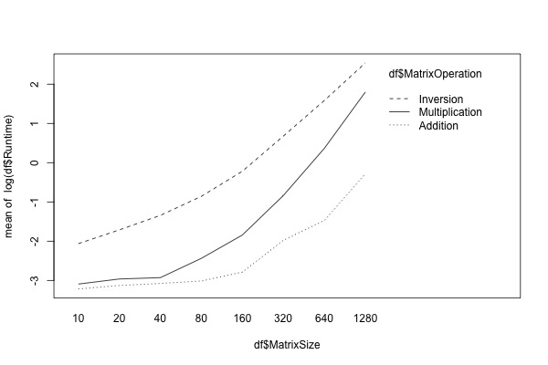
```

```{r}
jpeg(filename = "../figs/interaction_CPU_size_time.jpeg", width = 600, height = 400,quality = 10000)
interaction.plot(CPUdata$MatrixSize, CPUdata$MatrixOperation, CPUdata$Runtime)
while (!is.null(dev.list()))  dev.off()
```
```{r out.width = "90%", fig.align = "center", echo=FALSE}

```

```{r}
jpeg(filename = "../figs/interaction_GPU_size_time.jpeg", width = 600, height = 400,quality = 10000)
interaction.plot(GPUdata$MatrixSize, GPUdata$MatrixOperation, GPUdata$Runtime)
while (!is.null(dev.list()))  dev.off()
```
```{r out.width = "90%", fig.align = "center", echo=FALSE}
knitr::include_graphics("../figs/interaction_GPU_size_time.jpeg")
```

```{r}
jpeg(filename = "../figs/interaction_TPU_size_time.jpeg", width = 600, height = 400,quality = 10000)
interaction.plot(TPUdata$MatrixSize, TPUdata$MatrixOperation, TPUdata$Runtime)
while (!is.null(dev.list()))  dev.off()
```
```{r out.width = "90%", fig.align = "center", echo=FALSE}

```

## Boxplots

```{r}
jpeg(filename = "../figs/Operation_vs_runtime_size320.jpeg", width = 1400, height = 400,quality = 10000)
boxplot(Runtime~Processor*MatrixOperation, data = size320data, main="At the level of matrix size=320")
while (!is.null(dev.list()))  dev.off()
```
```{r out.width = "90%", fig.align = "center", echo=FALSE}
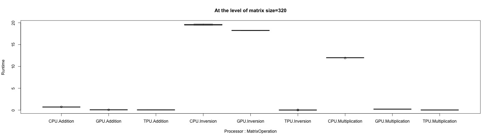
```

```{r}
jpeg(filename = "../figs/Operation_vs_runtime_size640.jpeg", width = 1400, height = 400,quality = 10000)
boxplot(Runtime~Processor*MatrixOperation, data = size640data, main="At the level of matrix size=640")
while (!is.null(dev.list()))  dev.off()
```
```{r out.width = "90%", fig.align = "center", echo=FALSE}
knitr::include_graphics("../figs/Operation_vs_runtime_size640.jpeg")
```

```{r}
jpeg(filename = "../figs/Operation_vs_runtime_size1280.jpeg", width = 1400, height = 400,quality = 10000)
boxplot(Runtime~Processor*MatrixOperation, data = size1280data, main="At the level of matrix size=1280")
while (!is.null(dev.list()))  dev.off()
```
```{r out.width = "90%", fig.align = "center", echo=FALSE}
knitr::include_graphics("../figs/Operation_vs_runtime_size1280.jpeg")
```

```{r}
jpeg(filename = "../figs/Operation_vs_runtime_size2560.jpeg", width = 1400, height = 400,quality = 10000)
boxplot(Runtime~Processor*MatrixOperation, data = size2560data, main="At the level of matrix size=2560")
while (!is.null(dev.list()))  dev.off()
```
```{r out.width = "90%", fig.align = "center", echo=FALSE}
knitr::include_graphics("../figs/Operation_vs_runtime_size2560.jpeg")
```
# Jingbin Cao Part II

## Plot Anova Residuals
### CPU Add
```{r}
jpeg(filename = "../figs/res_cpu_add.jpeg", width = 600, height = 400,quality = 10000)
m <- max(abs(mod_cpu_add$residuals))
plot(mod_cpu_add$fitted.values,mod_cpu_add$residuals, ylim=c(-m, m), main = "Residual Plot for CPU and Addition", xlab = "Fitted Values", ylab = "Residuals")
abline(h=0, col="red")
while (!is.null(dev.list()))  dev.off()

```
### CPU Multiplication
```{r}
jpeg(filename = "../figs/res_cpu_mult.jpeg", width = 600, height = 400,quality = 10000)
m <- max(abs(mod_cpu_mult$residuals))
plot(mod_cpu_mult$fitted.values ,mod_cpu_mult$residuals, ylim=c(-m, m), main = "Residual Plot for CPU and Multiplication", xlab = "Fitted Values", ylab = "Residuals")
abline(h=0, col="red")
while (!is.null(dev.list()))  dev.off()

```
### CPU Inversion
```{r}
jpeg(filename = "../figs/res_cpu_inv.jpeg", width = 600, height = 400,quality = 10000)
m <- max(abs(mod_cpu_inv$residuals))
plot(mod_cpu_inv$fitted.values,mod_cpu_inv$residuals, ylim=c(-m, m), main = "Residual Plot for CPU and Inversion", xlab = "Fitted Values", ylab = "Residuals")
abline(h=0, col="red")
while (!is.null(dev.list()))  dev.off()

```

### GPU Add
```{r}
jpeg(filename = "../figs/res_gpu_add.jpeg", width = 600, height = 400,quality = 10000)
m <- max(abs(mod_gpu_add$residuals))
plot(mod_gpu_add$fitted.values,mod_gpu_add$residuals, ylim=c(-m, m), main = "Residual Plot for GPU and Addition", xlab = "Fitted Values", ylab = "Residuals")
abline(h=0, col="red")
while (!is.null(dev.list()))  dev.off()
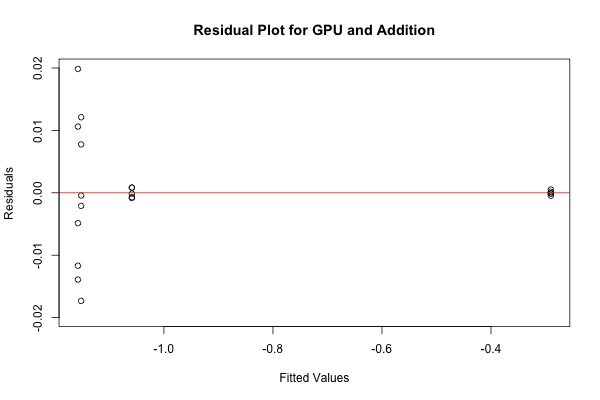
```
### GPU Multiplication
```{r}
jpeg(filename = "../figs/res_gpu_mult.jpeg", width = 600, height = 400,quality = 10000)
m <- max(abs(mod_gpu_mult$residuals))
plot(mod_gpu_mult$fitted.values ,mod_gpu_mult$residuals, ylim=c(-m, m), main = "Residual Plot for GPU and Multiplication", xlab = "Fitted Values", ylab = "Residuals")
abline(h=0, col="red")
while (!is.null(dev.list()))  dev.off()
knitr::include_graphics("../figs/res_gpu_mult.jpeg")
```
### GPU Inversion
```{r}
jpeg(filename = "../figs/res_gpu_inv.jpeg", width = 600, height = 400,quality = 10000)
m <- max(abs(mod_gpu_inv$residuals))
plot(mod_gpu_inv$fitted.values, mod_gpu_inv$residuals, ylim=c(-m, m), main = "Residual Plot for GPU and Inversion", xlab = "Fitted Values", ylab = "Residuals")
abline(h=0, col="red")
while (!is.null(dev.list()))  dev.off()
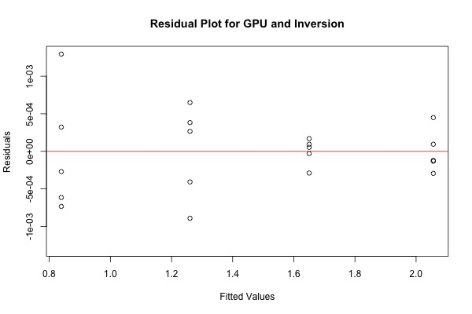
```

### TPU Add
```{r}
jpeg(filename = "../figs/res_tpu_add.jpeg", width = 600, height = 400,quality = 10000)
m <- max(abs(mod_tpu_add$residuals))
plot(mod_tpu_add$fitted.values, mod_tpu_add$residuals, ylim=c(-m, m), main = "Residual Plot for TPU and Addition", xlab = "Fitted Values", ylab = "Residuals")
abline(h=0, col="red")
while (!is.null(dev.list()))  dev.off()

```
### TPU Multiplication
```{r}
jpeg(filename = "../figs/res_tpu_mult.jpeg", width = 600, height = 400,quality = 10000)
m <- max(abs(mod_tpu_mult$residuals))
plot(mod_tpu_mult$fitted.values, mod_tpu_mult$residuals, ylim=c(-m, m), main = "Residual Plot for TPU and Multiplication", xlab = "Fitted Values", ylab = "Residuals")
abline(h=0, col="red")
while (!is.null(dev.list()))  dev.off()
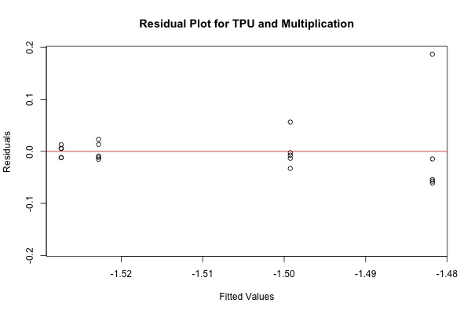
```
### TPU Inversion
```{r}
jpeg(filename = "../figs/res_tpu_inv.jpeg", width = 600, height = 400,quality = 10000)
m <- max(abs(mod_tpu_inv$residuals))
plot(mod_tpu_inv$fitted.values, mod_tpu_inv$residuals, ylim=c(-m, m), main = "Residual Plot for TPU and Inversion", xlab = "Fitted Values", ylab = "Residuals")
abline(h=0, col="red")
while (!is.null(dev.list()))  dev.off()
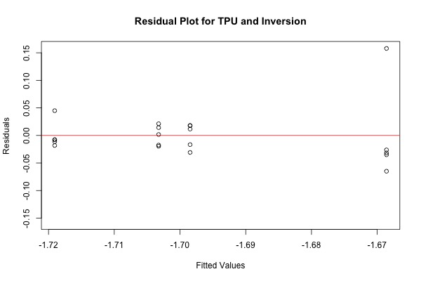
```
## Linear Regression for Matrix Size as continuous
We just need to run linear regression on seven pairs that do have Matrix Size Effects
```{r}
summary(lm_cpu_add <- lm(log10(Runtime)~as.numeric(MatrixSize),data=data[data$Processor == "CPU" & data$MatrixOperation=="Addition",]))
summary(lm_cpu_mult <- lm(log10(Runtime)~as.numeric(MatrixSize),data[data$Processor == "CPU" & data$MatrixOperation=="Multiplication",]))
summary(lm_cpu_inv <- lm(log10(Runtime)~as.numeric(MatrixSize),data[data$Processor == "CPU" & data$MatrixOperation=="Inversion",]))
summary(lm_gpu_add <- lm(log10(Runtime)~as.numeric(MatrixSize),data=data[data$Processor == "GPU" & data$MatrixOperation=="Addition",]))
summary(lm_gpu_mult <- lm(log10(Runtime)~as.numeric(MatrixSize),data[data$Processor == "GPU" & data$MatrixOperation=="Multiplication",]))
summary(lm_gpu_inv <- lm(log10(Runtime)~as.numeric(MatrixSize),data[data$Processor == "GPU" & data$MatrixOperation=="Inversion",]))
```


## Plot LM
### CPU Addition
```{r}
jpeg(filename = "../figs/res_lm_cpu_add.jpeg", width = 600, height = 400,quality = 10000)
m <- max(abs(lm_cpu_add$residuals))
plot(lm_cpu_add$fitted.values, lm_cpu_add$residuals, ylim=c(-m, m), main = "Residual Plot for CPU and Addition", xlab = "Fitted Values", ylab = "Residuals")
abline(h=0, col="red")
while (!is.null(dev.list()))  dev.off()
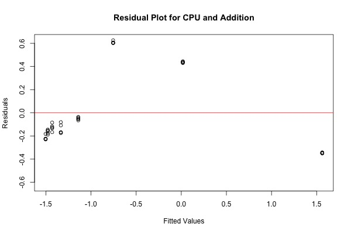
```
### CPU Multiplication
```{r}
jpeg(filename = "../figs/res_lm_cpu_mult.jpeg", width = 600, height = 400,quality = 10000)
m <- max(abs(lm_cpu_mult$residuals))
plot(lm_cpu_mult$fitted.values, lm_cpu_mult$residuals, ylim=c(-m, m), main = "Residual Plot for CPU and Multiplicatoin", xlab = "Fitted Values", ylab = "Residuals")
abline(h=0, col="red")
while (!is.null(dev.list()))  dev.off()
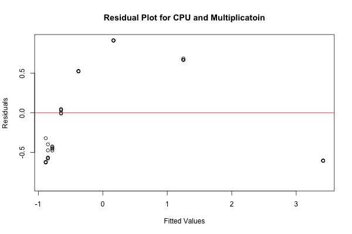
```

### CPU Inversion
```{r}
jpeg(filename = "../figs/res_lm_cpu_inv.jpeg", width = 600, height = 400,quality = 10000)
m <- max(abs(lm_cpu_inv$residuals))
plot(lm_cpu_inv$fitted.values, lm_cpu_inv$residuals, ylim=c(-m, m), main = "Residual Plot for CPU and Inversion", xlab = "Fitted Values", ylab = "Residuals")
abline(h=0, col="red")
while (!is.null(dev.list()))  dev.off()
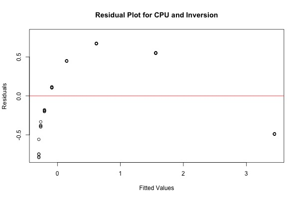
```

### GPU Addition
```{r}
jpeg(filename = "../figs/res_lm_gpu_add.jpeg", width = 600, height = 400,quality = 10000)
m <- max(abs(lm_gpu_add$residuals))
plot(lm_gpu_add$fitted.values, lm_gpu_add$residuals, ylim=c(-m, m), main = "Residual Plot for GPU and Addition", xlab = "Fitted Values", ylab = "Residuals")
abline(h=0, col="red")
while (!is.null(dev.list()))  dev.off()
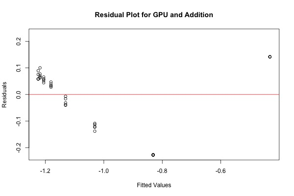
```
### GPU Multiplication
```{r}
jpeg(filename = "../figs/res_lm_gpu_mult.jpeg", width = 600, height = 400,quality = 10000)
m <- max(abs(lm_gpu_mult$residuals))
plot(lm_gpu_mult$fitted.values, lm_gpu_mult$residuals, ylim=c(-m, m), main = "Residual Plot for GPU and Multiplicatoin", xlab = "Fitted Values", ylab = "Residuals")
abline(h=0, col="red")
while (!is.null(dev.list()))  dev.off()
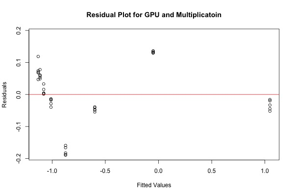
```

### GPU Inversion
```{r}
jpeg(filename = "../figs/res_lm_gpu_inv.jpeg", width = 600, height = 400,quality = 10000)
m <- max(abs(lm_gpu_inv$residuals))
plot(lm_gpu_inv$fitted.values, lm_gpu_inv$residuals, ylim=c(-m, m), main = "Residual Plot for GPU and Inversion", xlab = "Fitted Values", ylab = "Residuals")
abline(h=0, col="red")
while (!is.null(dev.list()))  dev.off()

```

At the level of matrix size=1280, avoid using CPU for inversion and multiplication because its run-times are much bigger.

```{r, message=FALSE, warning=FALSE, echo=FALSE}
# Addition & CPU
data[data$Processor == "CPU" & data$MatrixOperation=="Addition",] %>%
ggplot() +
geom_point(mapping = aes(x = MatrixSize, y = log(Runtime))) +
geom_smooth(mapping = aes(x = MatrixSize, y = log(Runtime))) +
labs(title = "For CPU and Addition with Different Matrix Size", x = "Matrix Size", y = "Runtime")
# Multiplication & CPU
data[data$Processor == "CPU" & data$MatrixOperation=="Multiplication",] %>%
ggplot() +
geom_point(mapping = aes(x = MatrixSize, y = log(Runtime))) +
geom_smooth(mapping = aes(x = MatrixSize, y = log(Runtime))) +
labs(title = "For CPU and Multiplication with Different Matrix Size", x = "Matrix Size", y = "Runtime")
# Invertion & CPU
data[data$Processor == "CPU" & data$MatrixOperation=="Inversion",] %>%
ggplot() +
geom_point(mapping = aes(x = MatrixSize, y = log(Runtime))) +
geom_smooth(mapping = aes(x = MatrixSize, y = log(Runtime))) +
labs(title = "For CPU and Invertion with Different Matrix Size", x = "Matrix Size", y = "Runtime")

# Addition & GPU
data[data$Processor == "GPU" & data$MatrixOperation=="Addition",] %>%
ggplot() +
geom_point(mapping = aes(x = MatrixSize, y = log(Runtime))) +
geom_smooth(mapping = aes(x = MatrixSize, y = log(Runtime))) +
labs(title = "For GPU and Addition with Different Matrix Size", x = "Matrix Size", y = "Runtime")
# Multiplication & GPU
data[data$Processor == "GPU" & data$MatrixOperation=="Multiplication",] %>%
ggplot() +
geom_point(mapping = aes(x = MatrixSize, y = log(Runtime))) +
geom_smooth(mapping = aes(x = MatrixSize, y = log(Runtime))) +
labs(title = "For GPU and Multiplication with Different Matrix Size", x = "Matrix Size", y = "Runtime")
# Invertion & GPU
data[data$Processor == "GPU" & data$MatrixOperation=="Inversion",] %>%
ggplot() +
geom_point(mapping = aes(x = MatrixSize, y = log(Runtime))) +
geom_smooth(mapping = aes(x = MatrixSize, y = log(Runtime))) +
labs(title = "For GPU and Invertion with Different Matrix Size", x = "Matrix Size", y = "Runtime")

# Addition & TPU
data[data$Processor == "TPU" & data$MatrixOperation=="Addition",] %>%
ggplot() +
geom_point(mapping = aes(x = MatrixSize, y = Runtime)) +
geom_smooth(mapping = aes(x = MatrixSize, y = Runtime)) +
labs(title = "For TPU and Addition with Different Matrix Size", x = "Matrix Size", y = "Runtime")
# Multiplication & TPU
data[data$Processor == "TPU" & data$MatrixOperation=="Multiplication",] %>%
ggplot() +
geom_point(mapping = aes(x = MatrixSize, y = Runtime)) +
geom_smooth(mapping = aes(x = MatrixSize, y = Runtime)) +
labs(title = "For TPU and Multiplication with Different Matrix Size", x = "Matrix Size", y = "Runtime")
# Invertion & TPU
data[data$Processor == "TPU" & data$MatrixOperation=="Inversion",] %>%
ggplot() +
geom_point(mapping = aes(x = MatrixSize, y = Runtime)) +
geom_smooth(mapping = aes(x = MatrixSize, y = Runtime)) +
labs(title = "For TPU and Invertion with Different Matrix Size", x = "Matrix Size", y = "Runtime")
```

